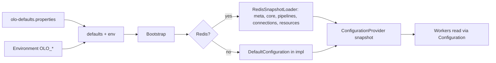

<!-- Copyright (c) 2026 Olo Labs. All rights reserved. -->

# Bootstrap

Part of the [olo-worker-configuration](olo-worker-configuration.md) documentation.

---

## Final worker flow

```
Worker Start
     │
     ▼
load defaults → env
     │
     ▼
initialize Redis client (if configured) → wait until Redis and snapshot available → build immutable configuration snapshot; atomically install snapshot into ConfigurationProvider
     │
     ▼
load tenant region map → start refresh scheduler (optional)
     │
     ▼
Worker runtime: workflow execution reads configuration from the local immutable snapshot
     │
     ▼
Every 60 sec:
  1. Read snapshot metadata from Redis
  2. Compare metadata version with local snapshot version
  If version changed: reload entire snapshot (core, pipelines, connections)
  Else: skip (no reload)
  (if Redis unavailable: keep current snapshot, retry next cycle)
```

---

## Worker startup flow (`Bootstrap.run()`)

Implementation: **`org.olo.configuration.Bootstrap`**.

1. Load **defaults** (`olo-defaults.properties`) and **environment** (`OLO_*`).  
2. **Enforce single region** in config (`Regions.enforceSingleRegion`) — worker process serves one primary region string (comma-separated lists are truncated to the first value for connection config).  
3. If **DB** is configured: register **`DbClient`** via **`ConfigurationPortRegistry`**; when **`olo.db.schema.autoapply`** is true, **`olo-worker-db`** applies bundled **`db/schema/*.sql`**.  
4. If **Redis or DB** is configured: **`TenantRegionResolver.loadFrom(...)`** so tenant→region data is available (Redis-first; may hydrate from DB).  
5. **If Redis is configured:**  
   - Wait until Redis is reachable and **meta + core** exist for the worker region; optionally **build snapshot from DB** (`ConfigSnapshotBuilder`) or **backfill pipeline section** (`PipelineSectionBuilder`) when Redis is empty but DB is available.  
   - Load worker region via **`RedisSnapshotLoader`**, then load **additional served regions** into **`ConfigurationProvider.setSnapshotMap`** (multi-region workers).  
6. **If Redis is not configured:** set **`ConfigurationProvider`** from defaults + env only.  
7. Start **config refresh** (periodic and/or Pub/Sub) and **TenantRegionRefreshScheduler** when enabled by config.

The tenant–region mapping can change at runtime. **TenantRegionRefreshScheduler** runs independently; see [06_operational_guidelines](06_operational_guidelines.md).

**Determining region:** The worker region is set with **`olo.region`** (one per process). Each region has an independent configuration snapshot. Typical ENV: **`OLO_REGION=us-east`**. If not set, defaults apply (see `olo-defaults.properties`).

**What “snapshot available” means:** The worker waits until the following exist in Redis (exact prefix depends on **`olo.cache.root-key`**, default root `olo`):
- **Snapshot metadata** — e.g. **`<root>:config:meta`**
- **Core configuration** — e.g. **`<root>:config:core`**

If either is missing, the worker does not start. This avoids partial snapshots and stuck workers.

**Timeout behavior** (`olo.bootstrap.config.wait.timeout.seconds`):

- **If timeout &gt; 0 and exceeded:** Worker exits with non-zero status; the orchestrator (e.g. Kubernetes) restarts the container.  
- **If timeout = 0 or unset:** Worker waits indefinitely until Redis and snapshot are available.

If Redis is not configured (e.g. local dev), the worker uses defaults + env only and skips snapshot wait/load (steps 5–7 above).

**Snapshot consistency:** Snapshots are written atomically by the admin service (e.g. Redis MULTI/EXEC). Workers load metadata first, then all referenced sections (core, pipelines, connections). If any required section is missing, the snapshot load fails and the worker retries on the next cycle. This avoids half-written snapshots.

---

## Default values file

- **Classpath resource**: `olo-defaults.properties`
- **Purpose**: Define default values for all keys (e.g. local dev).
- Infrastructure and local settings (Temporal, DB, cache, region list) live here and in ENV; they are **not** part of the Redis snapshot.

---

## Using configuration at runtime

**Bootstrap (once at startup):**

```java
Bootstrap.run();
```

**At runtime:** Read only from the in-memory configuration. Never query Redis or DB. Typical usage uses the layered config (global → region → tenant → resource):

```java
Configuration config = ConfigurationProvider.require();
String model = config.forContext(tenantId, "pipeline:chat").get("model", "gpt-4");
```

For tenant-only config: `config.forTenant(tenantId).get(...)`. For tenant + resource (e.g. pipeline): `config.forContext(tenantId, "pipeline:chat").get(...)`. Use **TenantRegionResolver.getRegion(tenantId)** when you need the tenant’s region.

---

## Flow diagram


